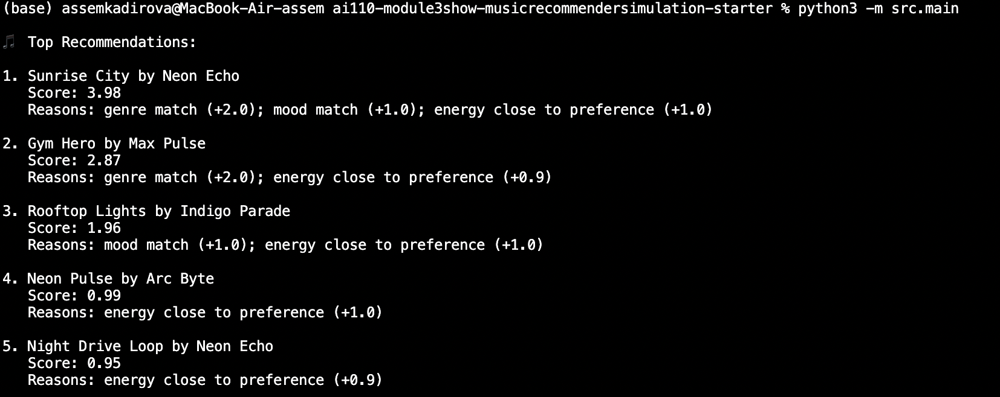

# 🎵 Music Recommender Simulation

## Project Summary

In this project you will build and explain a small music recommender system.

Your goal is to:

- Represent songs and a user "taste profile" as data
- Design a scoring rule that turns that data into recommendations
- Evaluate what your system gets right and wrong
- Reflect on how this mirrors real world AI recommenders

This simulation builds a simple content-based recommender that matches a user's preferred "vibe" to songs using song attributes. It prioritizes interpretability and small-scale experiments: songs are scored by similarity to a user's preferred genre, energy, valence (mood), and tempo, then ranked and returned. The focus is on clear, explainable scoring rules and on showing how weighting features changes recommendations.

---

## How The System Works

This music recommender system suggests songs based on a user’s preferences using a content-based filtering approach. It compares each song in the dataset to a user profile and assigns a score based on how well the song matches the user’s taste.

### Algorithm Recipe

The system uses a weighted scoring method with three main components:

- Genre match (40%)
- Mood match (30%)
- Audio feature similarity (30%)

#### 1. Genre Scoring
- 1.0 if the song’s genre is in the user’s favorite genres
- 0.0 if the song’s genre is in the user’s disliked genres
- 0.5 otherwise (neutral)

#### 2. Mood Scoring
- 1.0 if the song’s mood matches the user’s preferred moods
- 0.5 otherwise

#### 3. Audio Feature Similarity
The system compares numerical features such as:
- Energy
- Valence (happiness)
- Danceability

Similarity is calculated using a distance-based formula:

similarity = max(0, 1 - |song_value - user_value| / tolerance)

The final audio score is the average of these similarities.

#### 4. Final Score
The overall score is calculated as:

score = 0.4 * genre_score + 0.3 * mood_score + 0.3 * audio_score

Each song is scored and then ranked from highest to lowest. The system recommends the top K songs.

### Data Flow

Input:
- User preferences (genre, mood, energy, etc.)
- Song dataset (songs.csv)

Process:
- Loop through each song
- Calculate a score based on the algorithm
- Assign score to each song

Output:
- Songs sorted by score
- Top K recommendations returned to the user

### Potential Biases

This system may introduce several biases:

- It may over-prioritize genre, potentially ignoring songs from other genres that match the user’s mood or energy.
- It relies only on numerical features and predefined categories, so it cannot capture deeper aspects of music such as lyrics, cultural context, or personal memories.
- Songs that are very similar to past preferences may be recommended repeatedly, reducing diversity.

Despite these limitations, the system provides a simple and interpretable way to generate personalized music recommendations.


---

## Getting Started

### Setup

1. Create a virtual environment (optional but recommended):

   ```bash
   python -m venv .venv
   source .venv/bin/activate      # Mac or Linux
   .venv\Scripts\activate         # Windows

2. Install dependencies

```bash
pip install -r requirements.txt
```

3. Run the app:

```bash
python -m src.main
```

### Running Tests

Run the starter tests with:

```bash
pytest
```

You can add more tests in `tests/test_recommender.py`.

---

## Experiments You Tried

Use this section to document the experiments you ran. For example:

- What happened when you changed the weight on genre from 2.0 to 0.5
- What happened when you added tempo or valence to the score
- How did your system behave for different types of users

---

## Limitations and Risks

Summarize some limitations of your recommender.

Examples:

- It only works on a tiny catalog
- It does not understand lyrics or language
- It might over favor one genre or mood

You will go deeper on this in your model card.

---

## Reflection

Read and complete `model_card.md`:

[**Model Card**](model_card.md)

Write 1 to 2 paragraphs here about what you learned:

- about how recommenders turn data into predictions
- about where bias or unfairness could show up in systems like this


---

## 7. `model_card_template.md`

Combines reflection and model card framing from the Module 3 guidance. :contentReference[oaicite:2]{index=2}  

```markdown
# 🎧 Model Card - Music Recommender Simulation

## 1. Model Name

Give your recommender a name, for example:

> VibeFinder 1.0

---

## 2. Intended Use

- What is this system trying to do
- Who is it for

Example:

> This model suggests 3 to 5 songs from a small catalog based on a user's preferred genre, mood, and energy level. It is for classroom exploration only, not for real users.

---

## 3. How It Works (Short Explanation)

Describe your scoring logic in plain language.

- What features of each song does it consider
- What information about the user does it use
- How does it turn those into a number

Try to avoid code in this section, treat it like an explanation to a non programmer.

---

## 4. Data

Describe your dataset.

- How many songs are in `data/songs.csv`
- Did you add or remove any songs
- What kinds of genres or moods are represented
- Whose taste does this data mostly reflect

---

## 5. Strengths

Where does your recommender work well

You can think about:
- Situations where the top results "felt right"
- Particular user profiles it served well
- Simplicity or transparency benefits

---

## 6. Limitations and Bias

Where does your recommender struggle

Some prompts:
- Does it ignore some genres or moods
- Does it treat all users as if they have the same taste shape
- Is it biased toward high energy or one genre by default
- How could this be unfair if used in a real product

---

## 7. Evaluation

How did you check your system

Examples:
- You tried multiple user profiles and wrote down whether the results matched your expectations
- You compared your simulation to what a real app like Spotify or YouTube tends to recommend
- You wrote tests for your scoring logic

You do not need a numeric metric, but if you used one, explain what it measures.

---

## 8. Future Work

If you had more time, how would you improve this recommender

Examples:

- Add support for multiple users and "group vibe" recommendations
- Balance diversity of songs instead of always picking the closest match
- Use more features, like tempo ranges or lyric themes

---

## 9. Personal Reflection

A few sentences about what you learned:

- What surprised you about how your system behaved
- How did building this change how you think about real music recommenders
- Where do you think human judgment still matters, even if the model seems "smart"
```

## Example Output

